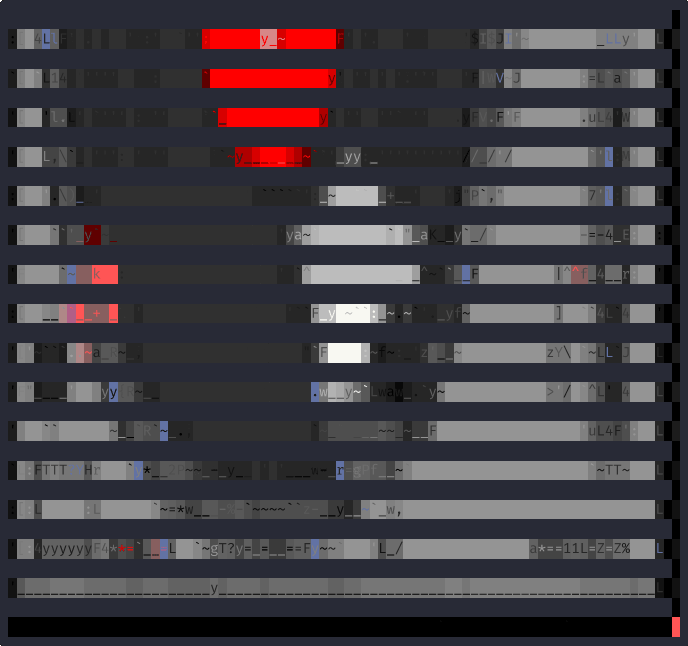

# right-round



A TUI for browsing 497 terminal progress indicators (378 spinners, 119 progress bars) from 26 open-source collections.

Navigate, preview live animations, and copy entries as JSON.

## Installation

### From source

```sh
go install github.com/cboone/right-round/cmd/right-round@latest
```

### From release

Download a binary from the [releases page](https://github.com/cboone/right-round/releases).

### Build locally

```sh
git clone https://github.com/cboone/right-round.git
cd right-round
make build
./bin/right-round
```

## Usage

```sh
# Launch the TUI
right-round

# Start locked to spinners only
right-round --type spinner

# Start locked to progress bars only
right-round --type progress_bar

# Start with a specific group selected
right-round --group braille
```

## Keybindings

| Key            | Action                                  |
| -------------- | --------------------------------------- |
| `j` / `down`   | Move cursor down                        |
| `k` / `up`     | Move cursor up                          |
| `pgdn`         | Page down                               |
| `pgup`         | Page up                                 |
| `home`         | Go to top                               |
| `end`          | Go to bottom                            |
| `left`         | Focus groups pane                       |
| `right`        | Focus entries/detail pane               |
| `[` / `]`      | Jump to previous/next group             |
| `s`            | Toggle group sort (alpha/size)          |
| `v`            | Toggle detail view (concise/verbose)    |
| `enter` / `l`  | Expand detail view (narrow mode)        |
| `esc` / `h`    | Collapse back to list                   |
| `tab`          | Switch between Spinners / Progress Bars |
| `/`            | Search/filter by name                   |
| `c`            | Copy selected entry as JSON             |
| `?`            | Toggle full help                        |
| `q` / `ctrl+c` | Quit                                    |

## Layout

- **Wide terminals** (100+ columns): browser pane (groups + entries) and detail panel side by side
- **Narrow terminals** (under 100 columns): browser and detail switch views
- **Browser pane**: groups scroll independently from entries, so you can browse deep within one group without losing group context

## Mouse

- Click tabs to switch indicator type
- Click group or entry rows to select
- Use wheel scrolling inside groups, entries, or detail panel

## Data

All 497 entries are embedded in the binary from `progress-indicators.json`, a consolidated catalog of terminal progress indicators collected from 26 open-source libraries, reference documents, gists, and blog posts.

### Entry types

- **Spinners** (378): animated frame sequences grouped into braille, line, dot, block, geometric, arrow, toggle, bounce, scroll, emoji, novelty, text, and symbol
- **Progress bars** (119): character sets for bar rendering grouped into ascii, block, geometric, decorative, phased, and emoji

## License

[MIT License](./LICENSE). TL;DR: Do whatever you want with this software, just keep the copyright notice included. The authors aren't liable if something goes wrong.
